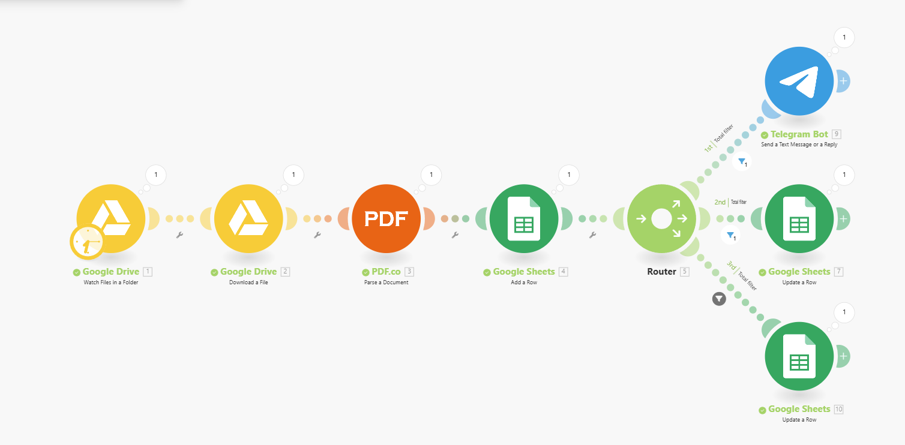

# Invoice Management Automation Project
 

**Organization:** Majestik Magik 

**Author:** Amos0312  

**Email:** amosmiller0312@gmail.com  

  

---

## 📌 Project Summary

**Title:** Invoice Management Automation with Make.com  
This project streamlines invoice handling by automating the entire workflow using **Make.com**, integrating **Google Drive**, **Google Sheets**, **PDF.co**, and **Telegram Bot**. It parses incoming invoice PDFs, extracts structured data, logs them in spreadsheets, and notifies users via Telegram—significantly reducing manual effort and improving operational efficiency.

---

## 🛠️ Tech Stack & Tools

- **[Make.com](https://www.make.com/)** – Automation platform for orchestrating workflows  
- **Google Drive** – For receiving and storing invoice PDFs  
- **Google Sheets** – For structured logging and data tracking  
- **PDF.co** – To parse and extract structured data from PDFs  
- **Telegram Bot** – Sends real-time updates to users  

---

## 🔄 Workflow Overview

1. **📂 Invoice Upload (Google Drive)**  
   - A specific folder in Google Drive is monitored for new PDF uploads.

2. **📤 Invoice Parsing (PDF.co via Make.com)**  
   - Uploaded files trigger Make.com to send PDFs to PDF.co for data extraction.  
   - Extracted fields include:
     - Invoice Number  
     - Issue Date  
     - Due Date  
     - Vendor Name  
     - Line Items  
     - Total Amount  

3. **📊 Data Logging (Google Sheets)**  
   - Parsed data is appended to a structured Google Sheet for record-keeping and analysis.

4. **📩 Notification (Telegram Bot)**  
   - After successful parsing and logging, a Telegram Bot sends a message with:
     - Invoice number  
     - Vendor  
     - Total amount  
     - Processing status  

---

## ✅ Features

- Fully automated, no-code solution
- Easy to scale and adapt for different invoice formats
- Near real-time Telegram alerts
- Audit-friendly, centralized logging
- Minimal manual effort required

---

## 🚀 Impact & Benefits

- Eliminated hours of manual data entry per week  
- Reduced potential for human error  
- Improved visibility and response times  
- Enabled a faster, more transparent invoice workflow  

---

> This project demonstrates how powerful no-code tools like Make.com can revolutionize back-office operations through automation and smart integrations.
